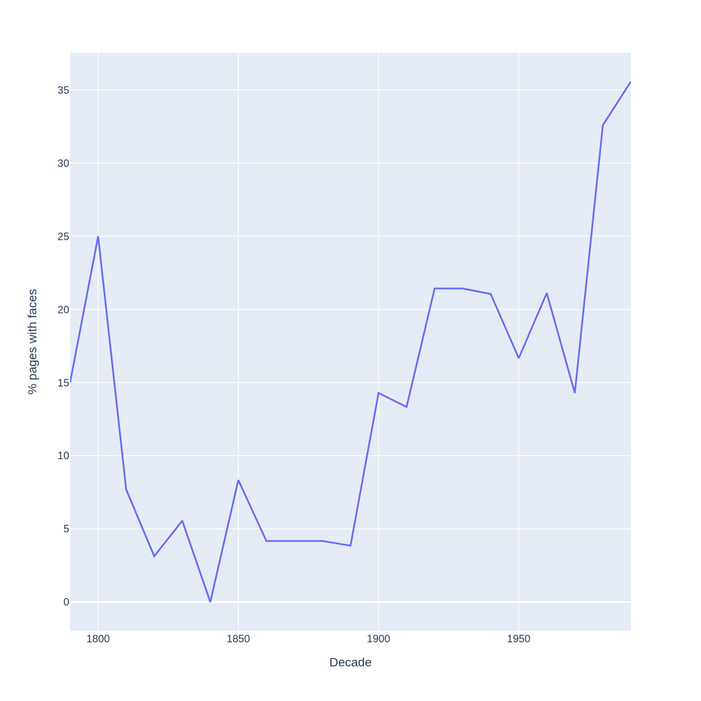
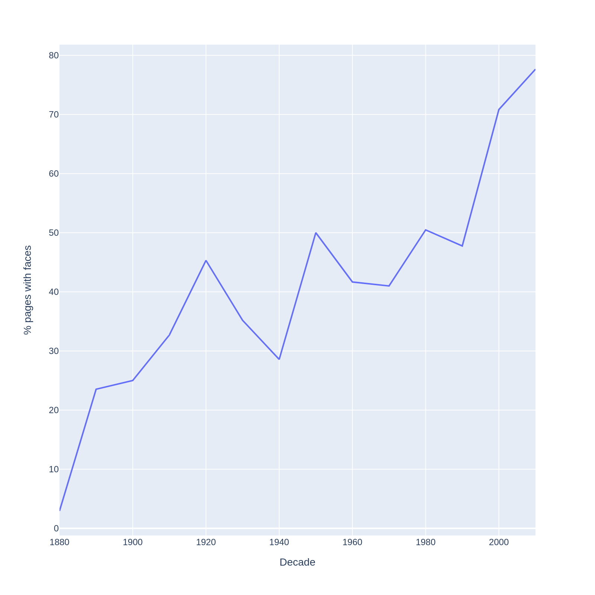
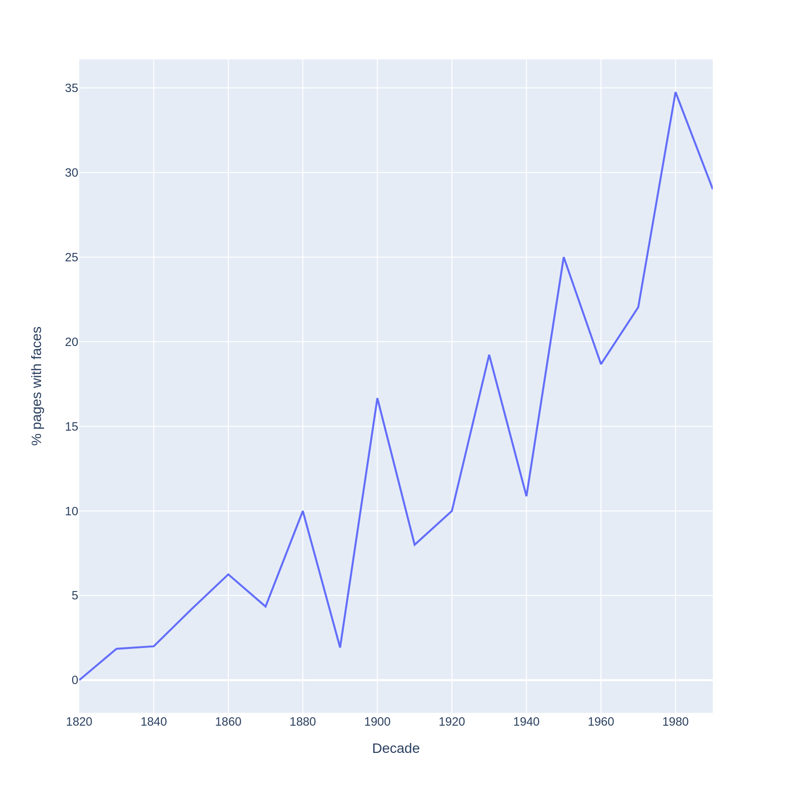

# visual-analytics-assignment4
Fourth assignment for visual analytics in Cultural Data Science.
The assignment is oriented at figuring out how the number of faces in the newspapers "Genève", "Gazette de Lausanne" and "Impartial" changes over time.


## Usage

The dataset is publicly available at [Zenodo](https://zenodo.org/records/3706863).

The `images.zip` file should be downloaded from the source and unzipped in a `dat/` directory.
```bash
mkdir dat
mv images.zip dat
cd dat
unzip images.zip
```

The folder structure should look like this:
```
- dat/
    - images/
        - GDL
            - GDL-1997-07-05-a-p0020.jpg
            ...
        - IMP
        - JDG
```

#### Install requirements:

```bash
pip install -r requirements.txt
```

#### Processing 

To find all faces in each page in the dataset run:

```bash
python3 src/count_faces.py
```

This will put the results in the `results/faces.jsonl` file.
Each record in the file contains metadata about the image that was processed, along with bounding boxes for all faces, and the number of faces in the image. <br>
Example:
```json
{"type": "success", "boxes": [], "n_faces": 0, "journal": "JDG", "page": "p0001", "year": 1950, "month": 5, "day": 5, "decade": 1950, "file": "dat/images/JDG/JDG-1950-05-05-a-p0001.jpg"}
```

If the processing failed, an error record is appended to the file with reason.<br>
Example:
```json
{"type": "error", "reason": "image file is truncated (174 bytes not processed)", "journal": "JDG", "page": "p0001", "year": 1980, "month": 7, "day": 30, "decade": 1980, "file": "dat/images/JDG/JDG-1980-07-30-a-p0001.jpg"}
```

#### Aggregation 

To produce aggregate results for interpretation, run the following:

```bash
python3 src/aggregate_results.py
```

This will output all visualizations into the `figures/` directory like so:
```
- figures/
    - GDL.png
    - IMP.png
    - JDG.png
```

And csv files containing aggregate information about each decade (number of faces, percentage of pages with faces on them) in the `results/` directory:
```
- results/
    - GDL.png
    - IMP.png
    - JDG.png
```

Example file:
```csv
journal,decade,total_faces,percent_contains_face
IMP,1880,1,2.941176470588235
IMP,1890,17,23.52941176470588
IMP,1900,25,25.0
IMP,1910,27,32.69230769230769
IMP,1920,46,45.3125
...
```

## Results

### Percentage of pages containing faces

On all plots we see and upwards tendency, espceially in the nineteenhundreds, in the percentage of pages that contain faces on them.

Surprisingly, in _Gazette de Lausanne_ we can observe a downwards tendency up until about 1830.
A quick investigation revealed that this is likely due to:
1. A lower number of articles in each decade. Up until and including the 1830's the mean number of articles per decade was 46, while decadesa after the 1830s on average contain 243. A large portion of these is from GDL.
2. False positives happen, especially on noiser images, like the ones that were made of older pages.


| GDL | IMP | JDG |
|----------|-----------|-----------|
||||


### Total number of faces

Looking at the total number of faces in recognized on pages reveals similar patterns, starting to rise around 1900 and steadily increasing since.
We can also observe that prior to the 1890s no decade had more than ten faces recognized by the model, further indicating the fact that the results we saw around 1800 in GDL are most probably a fluke.

|   decade | GDL   | IMP   | JDG   |
|----------|-------|-------|-------|
|     1790 | 3     |       |       |
|     1800 | 10    |       |       |
|     1810 | 2     |       |       |
|     1820 | 1     |       | 0     |
|     1830 | 2     |       | 1     |
|     1840 | 0     |       | 1     |
|     1850 | 2     |       | 2     |
|     1860 | 1     |       | 4     |
|     1870 | 1     |       | 5     |
|     1880 | 1     | 1     | 6     |
|     1890 | 1     | 17    | 1     |
|     1900 | 4     | 25    | 11    |
|     1910 | 4     | 27    | 6     |
|     1920 | 8     | 46    | 21    |
|     1930 | 8     | 31    | 32    |
|     1940 | 10    | 24    | 13    |
|     1950 | 8     | 105   | 49    |
|     1960 | 25    | 175   | 44    |
|     1970 | 14    | 202   | 48    |
|     1980 | 60    | 343   | 143   |
|     1990 | 115   | 210   | 190   |
|     2000 |       | 657   |       |
|     2010 |       | 699   |       |
